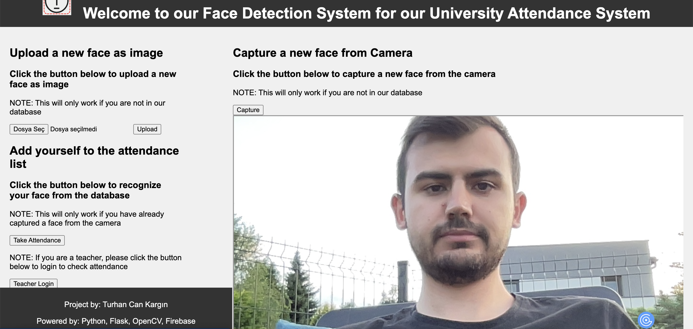
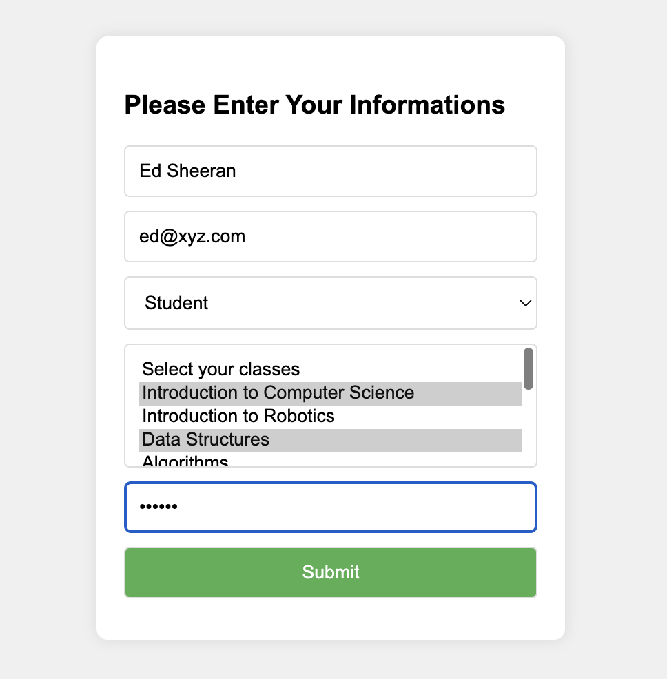
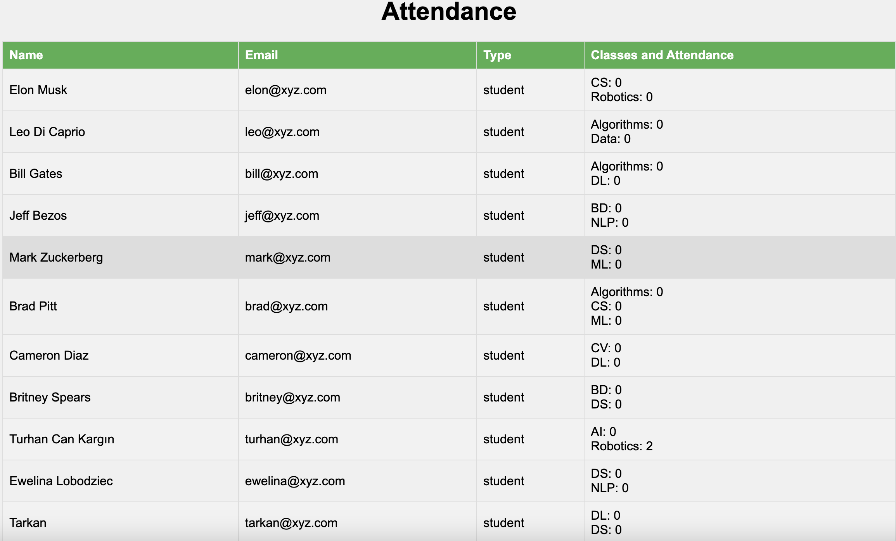

# Face-Attendance-Management-System
This project is a comprehensive attendance system that leverages the power of face recognition to identify individuals and mark their attendance. Built with Python, Flask, OpenCV, and Firebase, the system provides an efficient and automated solution to track attendance in various settings such as universities or workplaces. 

The system allows users to upload their image to the database, which is then used to recognize their face during attendance checks. The recognized faces are matched with the database, and the attendance is updated in real-time. The system also includes a secure login feature for teachers to view the attendance records. 

This project is an excellent example of how computer vision and machine learning can be used to automate traditional processes, making them more efficient and accurate.

## Table of Contents

- [Face Recognition Attendance System](#face-recognition-attendance-system)
  - [Table of Contents](#table-of-contents)
  - [Introduction](#introduction)
  - [Project Demo](#project-demo)
  - [Features](#features)
    - [Screenshots](#screenshots)
  - [Installation](#installation)
  - [Usage](#usage)
  - [Dependencies](#dependencies)
  - [Contribution](#contribution)
  - [Future Improvements](#future-improvements)
  - [License](#license)
  - [Technical Information](#technical-information)
    - [System Architecture Design](#system-architecture-design)
    - [Database Design](#database-design)
    - [Face Recognition System Development](#face-recognition-system-development)

## Introduction

In traditional attendance systems, the process of marking attendance is often manual, time-consuming, and prone to errors. With the advent of machine learning and computer vision, we now have the tools to automate this process and make it more efficient and accurate.

Our Face Recognition Attendance System is designed to leverage these technologies to provide a seamless and automated attendance tracking solution. The system uses face recognition technology to identify individuals and mark their attendance. This process eliminates the need for manual entry and reduces the chances of errors or fraudulent entries.

The system is built using Python, Flask, OpenCV, and Firebase. Python and Flask provide the backend functionality, OpenCV is used for face detection and recognition, and Firebase is used as the database to store user information and attendance records.

The system also includes a secure login feature for teachers, allowing them to view the attendance records. This feature ensures that only authorized individuals have access to the attendance data.

Whether you're a university looking to streamline your attendance tracking process or a business looking to automate your employee check-in system, our Face Recognition Attendance System provides a robust and efficient solution.

## Features

The **Face Recognition Attendance System** comes with a host of features designed to make attendance tracking as seamless and efficient as possible:

1. **Face Recognition**: The system uses advanced face recognition technology to identify individuals and mark their attendance. This eliminates the need for manual entry and ensures accuracy in attendance tracking.

2. **Real-Time Attendance Tracking**: The system tracks attendance in real-time. As soon as an individual is recognized by the system, their attendance is marked and updated in the database.

3. **Secure Teacher Login**: The system includes a secure login feature for teachers. This allows teachers to view the attendance records and ensures that only authorized individuals have access to this data.

4. **Multi-Class Support**: The system supports multiple classes. Students can be enrolled in multiple classes, and their attendance is tracked separately for each class.

5. **Database Integration**: The system is integrated with Firebase, a cloud-based NoSQL database. This allows for efficient storage and retrieval of user information and attendance records.

6. **Webcam Support**: The system supports webcam input for face recognition. This makes it easy to set up and use in a variety of settings.

7. **User-Friendly Interface**: The system features a user-friendly interface, making it easy for users to navigate and use the system.

8. **Open Source**: The system is open source. Developers are welcome to contribute and help improve the system.

### Screenshots

<figure align="center"> 
  
  <figcaption>Home Page of the Interface</figcaption>
</figure>

<figure align="center"> 
  
  <figcaption>Page to add student's information to the database (After capture image/upload image)</figcaption>
</figure>

<figure align="center"> 
  
  <figcaption>Page after Teacher Login (Attendance list)</figcaption>
</figure>

<figure align="center"> 
  
  <figcaption>Page after attending the class</figcaption>
</figure>

<figure align="center"> 
  
  <figcaption>Choosing a Class to Attend</figcaption>
</figure>

## Installation

To get the Face Recognition Attendance System up and running on your local machine, follow these steps:
